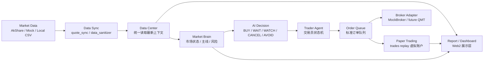

# AI Review Trading Architecture

本项目定位为 A 股复盘分析、策略验证和模拟交易工具。系统不自动下单，不连接真实券商，不提供真实投顾服务。

## 总体架构

## 分层职责

- Market Data：行情原始数据与 mock 数据入口。
- Data Sync：同步、校验和隔离脏数据。
- Data Center：全站统一数据读取入口，不执行交易逻辑。
- Market Brain：只做市场结构、情绪、主线、风险综合判断。
- AI Decision：把分析信号归一成当前个股决策。
- Trader Agent：唯一交易员状态机，只读决策和队列。
- Order Queue：标准订单对象暂存，不执行真实交易。
- Paper Trading：虚拟账户，只以 trades replay 为账本真相。
- Broker Adapter：券商适配抽象层，目前只允许 MockBroker。
- Report / Dashboard：只读 API，不直接读 CSV。

## 后端核心目录

- `web2/backend/app/api/routes.py`：API 路由和统一响应封装。
- `web2/backend/app/services/data_center.py`：统一数据中心。
- `web2/backend/app/services/pipeline_runner.py`：一键 AI 复盘编排。
- `web2/backend/app/services/pipeline_health.py`：全链路健康检查。
- `web2/backend/app/services/report_service.py`：报告和页面数据出口。
- `ledger_rebuilder.py`：Paper Trading 账本重放唯一写入器。

## Service 职责地图

| Service | 职责 | 输入 | 输出 | 禁止事项 |
| --- | --- | --- | --- | --- |
| `data_center.py` | 统一读取最新上下文 | reports, portfolio, data, frozen files | latest context | 不写交易文件 |
| `pipeline_runner.py` | 一键复盘编排 | API job request | job summary, logs | 不新增策略逻辑 |
| `pipeline_health.py` | 全链路健康检查 | DataCenter, Paper, Broker | health_score, checks | 不修数据，只诊断 |
| `data_sanitizer.py` | 脏数据隔离 | data/raw, portfolio, json/csv | quarantine, backups | 不删除历史文件 |
| `quote_sync.py` | 最新行情同步 | latest_report_date, holdings | daily_quotes file | 不静默失败 |
| `report_service.py` | 页面报告数据出口 | DataCenter, ledger status | dashboard/paper/leaders data | 不以旧 markdown 为真相 |
| `market_brain.py` | 市场大脑汇总 | DataCenter, emotion, leader engines | emotion/theme/risk/decision | 不写交易账本 |
| `emotion_cycle_engine.py` | 情绪周期判断 | cycle/risk/order data | stage, score, warning | 不生成订单 |
| `leader_lifecycle_engine.py` | 龙头生命周期 | leaders/trend/frozen data | lifecycle list | 不修改评分 |
| `mainline_engine.py` | 主线分析 | Market Brain/DataCenter | mainlines, leader tiers | 不重复写核心数据 |
| `daily_ai_report.py` | AI 日报 | Market Brain/DataCenter | report text | 不作为真相源 |
| `decision_center.py` | 决策摘要 | Market Brain, reports | summary/reasons/warnings | 不执行交易 |
| `ai_decision_engine.py` | 个股决策归一 | Market/Auction/Realtime | BUY/WAIT/WATCH/CANCEL/AVOID | 不自动下单 |
| `trader_agent.py` | 交易员状态机 | AI Decision, Order Queue | workflow/status | 不绕过订单队列 |
| `order_queue.py` | 订单队列展示 | AI Decision, risk gate | standard orders | 不发送真实委托 |
| `broker_adapter.py` | Broker 抽象接口 | order/balance requests | interface contract | 不绑定具体券商逻辑 |
| `mock_broker.py` | 模拟券商 | mock orders | mock balance/orders | 不连接真实券商 |
| `broker_center.py` | Broker 状态中心 | MockBroker, health | connection summary | 不执行实盘 |
| `broker_health.py` | Broker 健康检查 | broker heartbeat | health result | 不改订单 |
| `broker_log.py` | Broker 日志 | broker events | logs | 不影响交易决策 |
| `market_data_hub.py` | 行情数据中心 V0 | mock snapshot, DataCenter | market snapshot | 不接真实行情 |
| `auction_ai.py` | 集合竞价分析 V0 | mock auction, watchlist | auction decisions | 不读真实竞价 |
| `realtime_ai.py` | 实时 AI V0 | mock realtime events | event stream | 不发买入指令 |
| `pre_market_ai.py` | 盘前助手 | Market/Plan/Script | checklist/watchlist | 不接 9:25 实时数据 |
| `trading_plan_engine.py` | 交易计划 | Market Brain, leaders | plan cards | 不改 Paper Trading |
| `trade_script_engine.py` | 明日剧本 | Trading Plan, Market Brain | scripts | 不实时交易 |
| `job_manager.py` | 内存任务队列 | pipeline requests | job state | 不落交易数据 |
| `auth_service.py` | 本地会员模拟 | users file | user/membership | 不接真实支付 |

## 前端核心目录

- `web2/frontend/src/services/api.js`：前端唯一 API 客户端。
- `web2/frontend/src/views/Dashboard.vue`：AI 游资大脑首页。
- `web2/frontend/src/views/PaperTrading.vue`：虚拟账户页面。
- `web2/frontend/src/views/Market.vue`：今日市场摘要。
- `web2/frontend/src/views/Leaders.vue`：龙头排行榜。

## 禁止事项

- 不允许前端直接读取 CSV。
- 不允许分析模块直接写 `positions.csv` 或 `equity_curve.csv`。
- 不允许用旧 markdown 作为账户真相源。
- 不允许把成本价当最新价，除非 debug 明确标记 fallback。
- 不允许静默失败；Pipeline 必须返回 traceback 或明确错误步骤。
