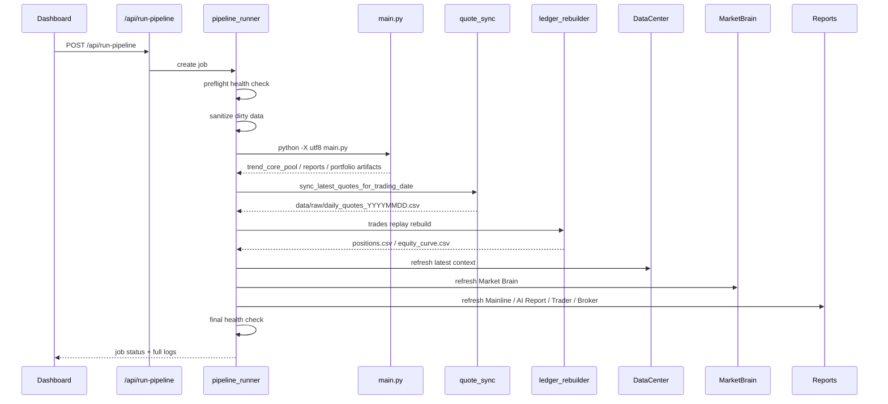

# Data Flow

## 一键 AI 复盘数据流

## 固定顺序

1. preflight health check
2. sanitize dirty data
3. run `main.py`
4. sync latest quotes
5. trades replay rebuild
6. refresh Data Center
7. refresh Market Brain
8. refresh Mainline
9. refresh AI Report
10. refresh Paper Trading
11. refresh Trader Agent
12. refresh Broker Center
13. final health check

## 价格估值流

`daily_quotes_YYYYMMDD.csv` 是最新价真相源。Paper Trading 估值顺序：

1. `data/raw/daily_quotes_YYYYMMDD.csv`
2. `data/processed/daily_quotes_YYYYMMDD.csv`
3. 全量行情缓存或 MarketHub snapshot
4. `trend_core_pool_YYYYMMDD.csv`
5. `positions.csv` 旧价 fallback
6. 成本价 fallback

如果使用 5 或 6，必须在 `/api/paper/data.debug.fallback_price_codes` 中暴露。

## 页面数据流

Dashboard、Paper Trading、Market、Leaders 等页面只调用 API：

- `/api/market-brain`
- `/api/dashboard`
- `/api/paper/data`
- `/api/leaders`
- `/api/pipeline-health`

页面不得直接读取本地 CSV 或 markdown。
